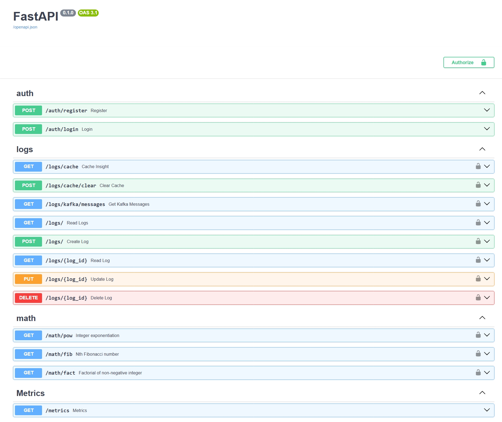

# Math Operations API

A lightweight FastAPI microservice that exposes three math utilities - integer power, Fibonacci, and factorial. Every
request is persisted to SQLite database and published to a Kafka topic. Admin-role users can manage the log table;
regular users only call math endpoints. JWT tokens and role links manage access. Prometheus scrapes builtin `/metric`.

Two ways to run this app:

1. **Locally** with Docker Compose, which includes Kafka, Prometheus, and a Kafka UI for easy management.
2. **Serverless** on AWS Lambda with API Gateway, using a Docker image and the Mangum adapter to handle
   requests. This allows you to run the same code in a fully managed environment without worrying about
   server maintenance.

---

## ⚡ FastAPI

FastAPI is a modern Python web framework that turns simple, type-hinted functions into high-performance REST endpoints.
It auto-validates inputs, generates interactive Swagger docs at `/docs`, and runs asynchronously on Uvicorn—so you get
speed, built-in validation, and ready-made documentation with almost no boilerplate.

---

## Live FastAPI API Explorer



---

## 📈 Prometheus

Prometheus is an open-source metrics monitoring and alerting toolkit that scrapes time-series data from configured
targets (like this app’s `/metrics` endpoint) and stores it for querying, alerting, and dashboarding.
You may also add custom metrics (e.g., `math_calls_total`) to track specific function calls, sources (cache vs compute),
or errors.
To query Prometheus use expressions like `up`, `http_requests_total`, `math_calls_total`.

⚠️ Note: The Prometheus UI is only accessible when the application is started via Docker (**`docker compose up`**).
Prometheus must be running as a separate service to collect and display metrics.

___

## Live Prometheus API Explorer


---

## 📨 Kafka Integration

Kafka is used in this project to handle asynchronous messaging between the math service and logging mechanisms.
When a user makes a request to the Fibonacci, power, or factorial endpoints, the request details are serialized and sent
to Kafka topics (`fibonacci-requests`, `pow-requests`, `factorial-requests`) via a producer.
A dedicated consumer asynchronously listens on these topics and processes messages in the background, decoupling request
handling from background logging or other processing.
This setup improves responsiveness and enables scalable event-driven data flow.

---


---

### Apache Kafka UI

To make Kafka operations easier to observe and manage, the [Kafka UI](https://github.com/provectus/kafka-ui) is included
in the Docker Compose setup.
This interface allows you to visually inspect available topics, see real-time messages, monitor consumer groups, check
broker status, and even manually publish messages for testing.
It's available by default at `http://localhost:8081` when the stack is running via Docker.

---

## ✨ Features

* **LRU-cached math functions** → logarithmic power, fast-doubling Fibonacci, C-backed factorial.
* **Role-based access control (RBAC)** → JWT auth; user role for math endpoints, admin role for full CRUD on the /logs
  table.
* **Automatic DB bootstrap** → tables (User, Role, UserRoleLink, RequestLog) created on first start; `seed_admin()`
  inserts a default admin.
* **Prometheus metrics** – built-in `/metrics` endpoint (Prometheus text format) for request count, latency, and
  cache-hit ratios; ready to scrape.
* **Kafka-based messaging** → all math requests are published to Kafka topics and consumed asynchronously.
* **Pre-commit quality gate** → Black ⇢ isort ⇢ Ruff ⇢ Flake8.
* **Fully async test-suite** → Pytest suite with isolated temporary database fixture.

---

## 📦 Docker

This project can be run in a Docker container for easy deployment and isolation (see the `Quick Start`
section
below). To run the API in a Docker container, you can build and run it with the following commands:

```bash
docker-compose down -v : Stops and removes all services, including volumes (e.g., metrics or DB data).
docker-compose up --build : Builds and starts all services defined in the docker-compose.yml.
```

The default Dockerfile waits for Kafka (`wait-for-kafka.sh`) then starts Uvicorn on :8080.

Or use Rancher Desktop / Kubernetes with the provided k8s/ manifests (Deployment, Service, Secret).

---

## 🚀 Quick Start (local)

```bash
git clone https://github.com/your-org/MathOperationsApp.git
cd MathOperationsApp
cp .env.example .env                                          # set a strong SECRET_KEY inside!
python -m venv .venv && .\.venv\Scripts\Activate              # Linux/Mac: source .venv/bin/activate
pip install -r requirements.txt -r requirements-dev.txt
pytest -q                                                     # optional: run tests
docker compose up --build                                     # Kafka + Prometheus + API + Kafka-UI
# Swagger:     http://localhost:8080/docs
# Prometheus:  http://localhost:9090
# Kafka-UI:    http://localhost:8081
```

SQLite file `requests.db` is created in the project root; it’s already .gitignored.

---

## 🚀 Serverless deployment (AWS Lambda + API Gateway)

> These steps assume you have the AWS CLI configured and Docker installed.

We keep a second image (`Dockerfile.lambda`) and a minimal wrapper (`lambda_handler.py` with Mangum) so the same code
runs in AWS Lambda.

### 1. One-time bootstrap script

*Uses environment variables from `.env`.*

```bash
chmode +x deploy.sh

./deploy.sh
```

The script will:

1. build the Lambda image
2. create (if needed) + push to an ECR (Elastic Container Registry) repo in AWS
3. create or update an AWS Lambda function called `math-api-lambda`

### 2. Finish the setup in the AWS console

1. **Open the Lambda function**

   *AWS Console ▸ Lambda ▸ **math-api-lambda** ▸ Configuration*

2. **Add three environment variables**

   | Key | Example value | Needed for                                 |
                                                                                                               |-----|---------------|--------------------------------------------|
   | `SECRET_KEY` | `please-change-me` | JWT signing                                |
   | `DATABASE_URL` | `sqlite:///tmp/requests.db` | where to store the log table |
   | `KAFKA_BOOTSTRAP` <br>*optional* | `broker.example.com:9092` | publish to Kafka              |

   Click **Edit ▸ Add environment variable ▸ Save**.

3. **Create an HTTP endpoint**

    1. *AWS Console ▸ API Gateway ▸ Create API ▸ **HTTP API***
    2. **Integration** → select **math-api-lambda**.
    3. **Route** → Method **ANY**, Path **`/{proxy+}`** (sends every URL to FastAPI).
    4. Click **Create**.

4. **Copy the invoke URL** that API Gateway shows, e.g. `https://abc123.execute-api.us-east-1.amazonaws.com`

5. **Test the API** using the copied URL

Use Swagger UI at `https://<API_URL>/docs` to explore the API, or use `curl` to test the endpoints directly.

```bash
API="https://abc123xyz.execute-api.eu-central-1.amazonaws.com"  # change to your API URL

# 1. Get a JWT for admin/admin1234
TOKEN=$(
  curl -s -X POST "$API/auth/login" \
    -H "Content-Type: application/x-www-form-urlencoded" \
    -d "username=admin&password=admin1234" \
  | jq -r .access_token
)

echo "Got token: $TOKEN"

# 2a. Call an admin-only endpoint (e.g., /logs) to see the log table
curl "$API/logs/" \
  -H "Authorization: Bearer $TOKEN"
  
# 2b. Call a math endpoint (e.g. to compute Fibonacci)
curl "$API/math/fib?n=7" \
  -H "Authorization: Bearer $TOKEN"

```

---

## 👥 Contributors

| Name               | Key areas                                                                                                                                            |
|--------------------|------------------------------------------------------------------------------------------------------------------------------------------------------|
| **Irina Morosanu** | • Core FastAPI app & routing<br> • Auth & role-based access control<br>• Math algorithms & caching<br>• Pre-commit config<br>• Testing• Lambda image |
| **Alexandru Baba** | • Project setup<br>• Core FastAPI app & routing<br> • Prometheus `/metrics` integration<br>• Kafka integration<br> • Containerization<br>• Testing   |